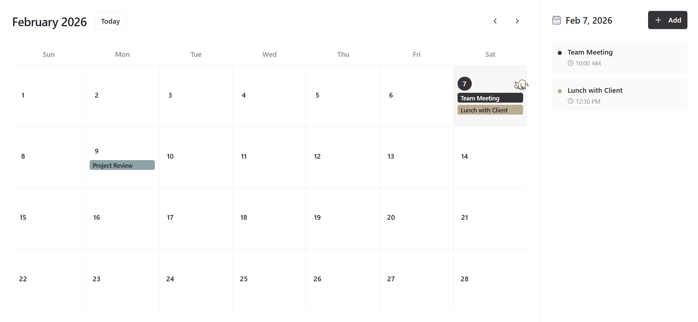

# My Daily Planner

A modern, responsive calendar application built with React, TypeScript, and Tailwind CSS. My Daily Planner helps you organize your schedule with an intuitive interface for managing events and daily tasks.



## Features

- **Interactive Calendar View**: Navigate through months with ease
- **Event Management**: Add, view, and remove events for any date
- **Color-Coded Events**: Organize your events with different colors
- **Responsive Design**: Works seamlessly on desktop and mobile devices
- **Modern UI**: Built with shadcn/ui components for a polished experience
- **Fast Performance**: Optimized with React hooks and efficient state management
- **Tested**: Includes unit tests with Vitest

## Tech Stack

- **Frontend**: React 18 with TypeScript
- **Styling**: Tailwind CSS with custom components
- **UI Components**: shadcn/ui with Radix UI primitives
- **Routing**: React Router DOM
- **State Management**: React hooks and context
- **Date Handling**: date-fns library
- **Build Tool**: Vite
- **Testing**: Vitest with Testing Library
- **Package Manager**: Bun

## Getting Started

### Prerequisites

- Node.js (version 18 or higher)
- Bun package manager

### Installation

1. Clone the repository:
```bash
git clone https://github.com/Hrpavi7/My-Daily-Planner.git
cd My-Daily-Planner
```

2. Install dependencies:
```bash
bun install
```

3. Start the development server:
```bash
bun run dev
```

4. Open your browser and navigate to `http://localhost:8080` (or `localhost:5173` in some cases)

## Available Scripts

- `bun run dev` - Start development server
- `bun run build` - Build for production
- `bun run build:dev` - Build for development
- `bun run lint` - Run ESLint
- `bun run preview` - Preview production build
- `bun run test` - Run tests
- `bun run test:watch` - Run tests in watch mode

## Project Structure

```
src/
├── components/          # React components
│   ├── calendar/      # Calendar-specific components
│   └── ui/            # Reusable UI components
├── hooks/             # Custom React hooks
├── lib/               # Utility functions
├── pages/             # Page components
├── types/             # TypeScript type definitions
└── test/              # Test files
```

## Key Components

- **CalendarGrid**: Main calendar display with month view
- **CalendarHeader**: Navigation and month/year display
- **EventSidebar**: Shows events for selected date
- **AddEventDialog**: Modal for creating new events
- **useCalendarEvents**: Custom hook for event management

## Features in Detail

### Event Management
- Add events with title, date, and optional time
- Color-code events for better organization
- Remove events with a single click
- View all events for a selected date

### Calendar Navigation
- Navigate between months with previous/next buttons
- Quick jump to today's date
- Visual indication of current date
- Highlight selected date

### Responsive Design
- Mobile-friendly interface
- Collapsible sidebar on smaller screens
- Touch-friendly interactions
- Optimized layouts for all device sizes

## Development

### Adding New Features

1. Follow the existing code structure and conventions
2. Use TypeScript for type safety
3. Implement proper error handling
4. Add tests for new functionality
5. Update documentation as needed

### Code Style

- Use functional components with hooks
- Follow the existing naming conventions
- Implement proper TypeScript interfaces
- Use Tailwind CSS classes for styling
- Follow React best practices

## Testing

Run the test suite:
```bash
bun run test
```

Run tests in watch mode during development:
```bash
bun run test:watch
```

## Building for Production

```bash
bun run build
```

The built files will be in the `dist` directory, ready to be served by your preferred web server.

## Contributing

1. Fork the repository
2. Create a feature branch (`git checkout -b feature/amazing-feature`)
3. Commit your changes (`git commit -m 'Add some amazing feature'`)
4. Push to the branch (`git push origin feature/amazing-feature`)
5. Open a Pull Request

## License

This project is licensed under the MIT License - see the LICENSE file for details.

## Support

If you encounter any issues or have questions, please open an issue on the GitHub repository.

---

Built with dopamine using React, TypeScript, and modern web technologies.
